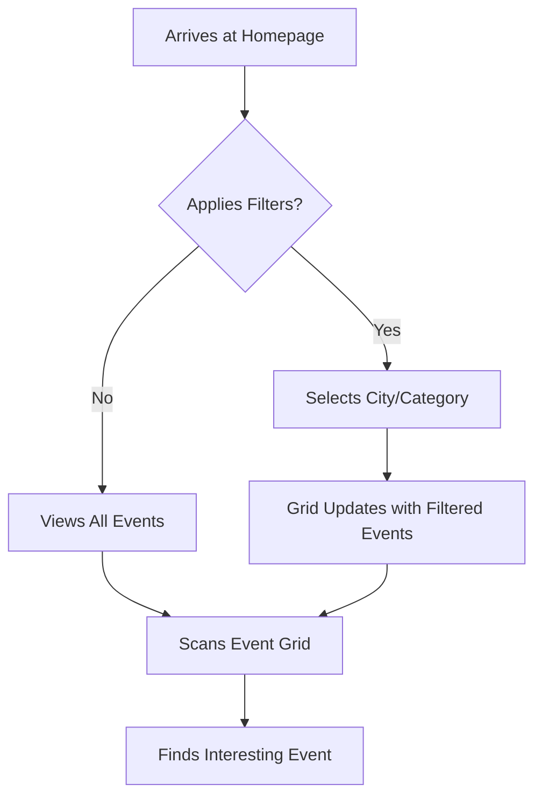
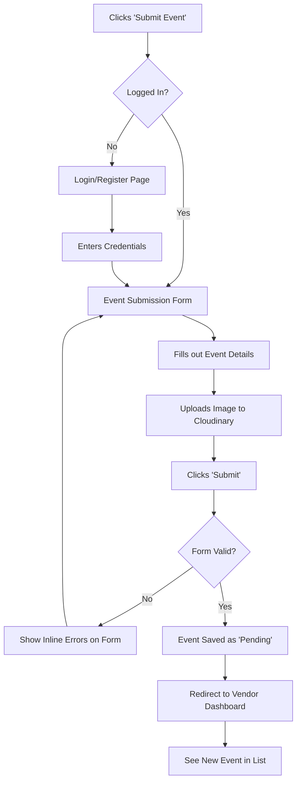
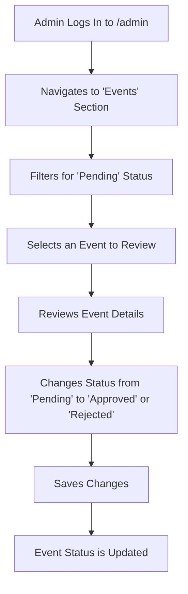

# CulturaLite UI/UX Specification

## Introduction

This document defines the user experience goals, information architecture, user flows, and visual design specifications for CulturaLite's user interface. It serves as the foundation for visual design and frontend development, ensuring a cohesive and user-centered experience.

### Overall UX Goals & Principles

#### Target User Personas

  * **Event Organizers (Vendors):** This user needs an efficient, clear, and encouraging process. The design should minimize friction for submitting events and build trust that their content is being handled professionally.
  * **General Public (Attendees):** This user is seeking a visually engaging, simple, and fast discovery experience. They are Browse for leisure and will abandon the site if it is slow, cluttered, or confusing.
  * **Platform Admins:** This user requires a functional and unambiguous interface for the core task of moderation. For the MVP, this experience will be through the standard Django Admin interface.

#### Usability Goals

  * **Vendor Efficiency:** A first-time vendor should be able to submit a new event in under 5 minutes.
  * **Attendee Discoverability:** A public user should be able to find relevant events within 3 clicks.
  * **Clarity & Confidence:** All users should feel confident in their actions, with clear feedback and no ambiguity about the status of an event or submission.
  * **High Satisfaction:** The interface should feel joyful and culturally resonant, not like a generic, corporate platform.

#### Design Principles

1.  **Clarity Above All:** The interface must be immediately understandable. We will prioritize clear communication over clever but potentially confusing interactions.
2.  **Celebrate Culture:** We will use color, typography, and imagery to create a vibrant, festive atmosphere that feels authentic to the events being showcased.
3.  **Performance is a Core Feature:** The site must be exceptionally fast and responsive on all devices. A slow interface feels like a broken one.
4.  **Mobile-First, Always:** The primary design target will be the mobile experience, ensuring the site is beautiful and functional on a small screen before scaling up to desktop.

## Information Architecture (IA)

### Site Map / Screen Inventory

This diagram shows the primary pages and sections of the application and how they relate to each other.

```mermaid
graph TD
    subgraph Public Area
        A[Homepage: /] --> B[City Listings: /events/[city]];
    end

    subgraph Vendor Area
        C[Login: /login] --> E[Dashboard: /dashboard];
        D[Register: /register] --> C;
        E --> F[View My Events];
        E --> G[Submit New Event: /dashboard/submit];
        E --> H[View Notifications];
    end
    
    subgraph Admin Area
        I[Django Admin: /admin]
    end

    A --> C;
    A -- "Submit Event Button" --> C;
```

### Navigation Structure

  * **Public Navigation (Header for non-logged-in users):**
      * **Logo:** Links back to the Homepage.
      * **Submit Event Button:** Links to the Login page, prompting vendors to sign in or register.
  * **Vendor Navigation (Header for logged-in vendors):**
      * **Dashboard:** Main view showing submitted events.
      * **Submit New Event:** A clear call-to-action to access the submission form.
      * **Notifications:** An icon or link to view status updates.
      * **Logout:** To securely end the session.
  * **Breadcrumbs:**
      * Not a priority for the MVP's simple structure. Can be added later within the vendor dashboard to improve navigation if more sections are added.

## User Flows

### Flow 1: Public User Discovers an Event

**User Goal:** To find a local cultural event that matches their interests.
**Entry Points:** Navigating directly to the homepage, arriving from a search engine link.
**Success Criteria:** The user can easily apply filters and identify a relevant event from the displayed grid.

#### Flow Diagram



**Edge Cases & Error Handling:**

  * **No Events Match Filter:** If applying a filter results in zero events, the grid will display a friendly message like "No events found for this filter. Try another search\!"
  * **No Events at All:** If there are no approved events in the system, the homepage will show a message encouraging organizers to submit their events.

### Flow 2: Vendor Submits a New Event

**User Goal:** To add their new event to the platform for moderation and public listing.
**Entry Points:** Clicking the "Submit Event" button from the homepage or dashboard.
**Success Criteria:** The vendor successfully navigates the login/registration, fills out the form, uploads an image, and submits the event, receiving a confirmation that it is pending review.

#### Flow Diagram



**Edge Cases & Error Handling:**

  * **Invalid Form Data:** The form will show clear, inline error messages next to the fields that need correction.
  * **Image Upload Failure:** If the Cloudinary upload fails, a message will appear asking the user to try again, without losing the data they've entered in other fields.

### Flow 3: Admin Moderates an Event

**User Goal:** To review a newly submitted event and either approve it for public display or reject it.
**Entry Points:** Logging into the Django Admin panel.
**Success Criteria:** An admin can quickly find pending events and change their status with a single action.

#### Flow Diagram



**Edge Cases & Error Handling:**

  * **Accidental Action:** The Django Admin interface inherently allows an admin to change the status back if they make a mistake.

## Wireframes & Mockups

Detailed, high-fidelity mockups will be created in a dedicated design tool (e.g., Figma) if required. For the initial MVP development, the layout and composition will be guided by the `shadcn/ui` component library's documentation and best practices.

## Component Library / Design System

The project will use **`shadcn/ui`** as its base component library. This provides a set of accessible, unstyled components that we will style using Tailwind CSS according to our brand guidelines. The primary goal is to maintain visual and interactive consistency across the entire application.

## Branding & Style Guide

### Visual Identity

The visual identity should be colorful, clean, and modern, reflecting the vibrancy of the cultural events being showcased.

### Color Palette

  * **Primary:** `#F97316` (Orange) - Used for primary calls-to-action, links, and highlights.
  * **Accent:** `#22C55E` (Green) - Used for success states, notifications, and secondary highlights.
  * **Backgrounds:** White and light gray (`#F3F4F6` or similar) will be used to maintain a clean, uncluttered feel.

### Typography

  * **Font Family:** Inter (to be used for all text, including headings and body copy).

## Accessibility Requirements

The application will adhere to general web accessibility best practices, with the goal of being compliant with **WCAG 2.1 Level AA** where feasible. This includes ensuring sufficient color contrast, keyboard navigability, and semantic HTML structure.

## Responsiveness Strategy

A **mobile-first** approach will be used. All components and layouts will be designed for small screens first and then scaled up for tablet and desktop using Tailwind CSS's responsive breakpoints.

----