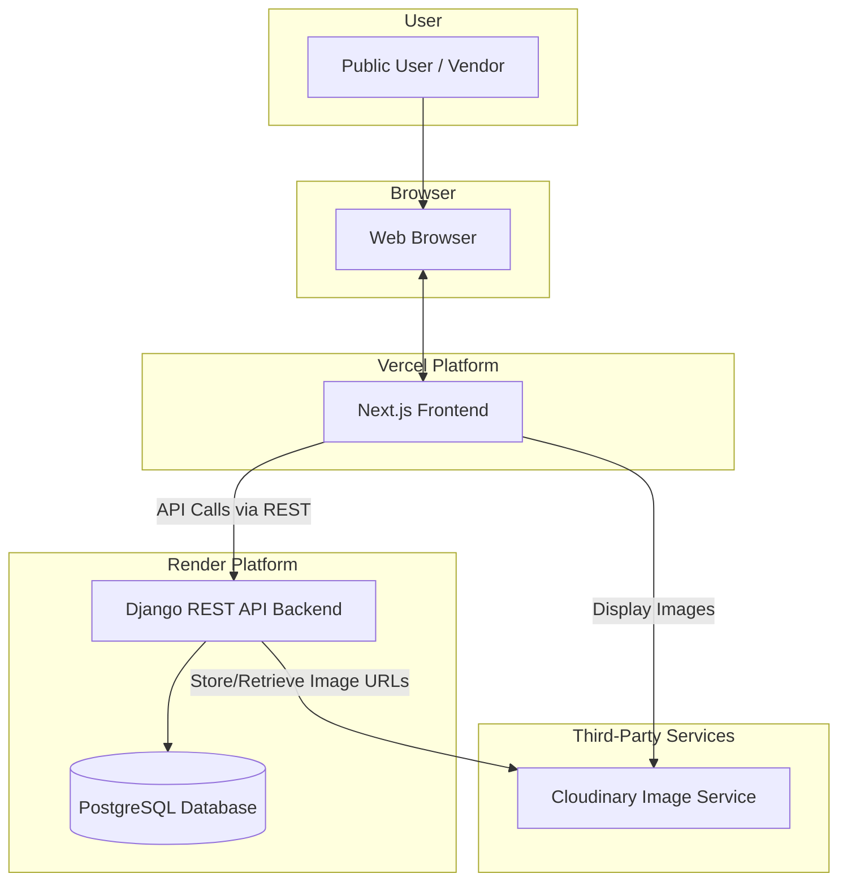
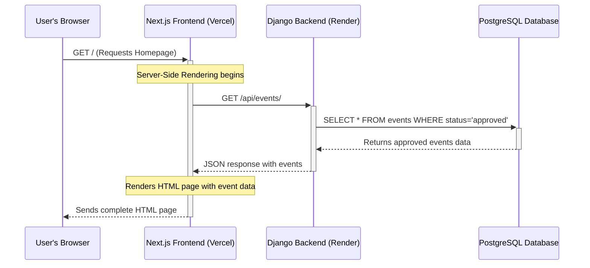
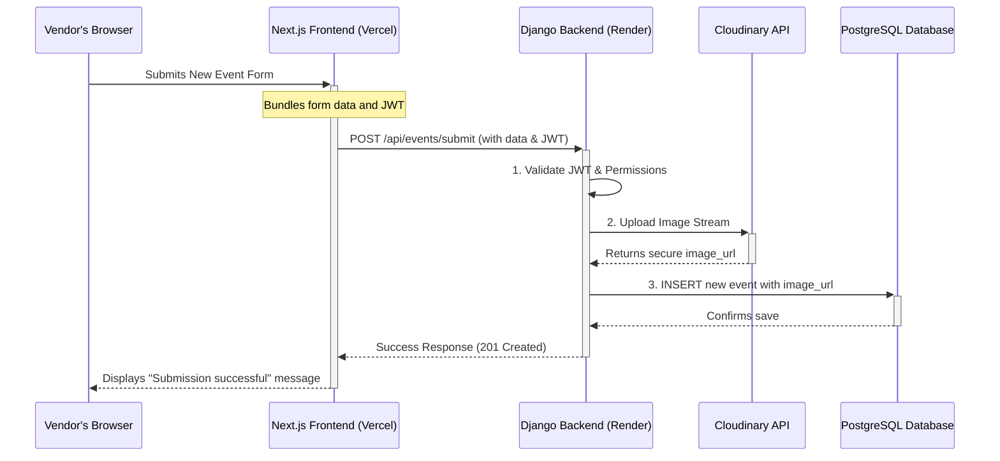

# CulturaLite Fullstack Architecture Document

## Introduction

This document outlines the complete fullstack architecture for CulturaLite, including backend systems, frontend implementation, and their integration. It serves as the single source of truth for AI-driven development, ensuring consistency across the entire technology stack. This unified approach combines what would traditionally be separate backend and frontend architecture documents, streamlining the development process for modern fullstack applications where these concerns are increasingly intertwined.

### Starter Template or Existing Project

This is a **Greenfield project**.

The project will be built from clean foundations using the official CLI tools for each major technology, rather than a third-party, all-in-one template. This approach provides maximum control and ensures the project starts with a clean, up-to-date, and un-opinionated codebase.

  * **Frontend Initialization:** `npx create-next-app@14`
  * **Backend Initialization:** `django-admin startproject`

### Change Log

| Date | Version | Description | Author |
| :--- | :--- | :--- | :--- |
| 2025-06-26 | 1.0 | Initial architecture document creation. | Winston (Architect) |
| 2025-06-26 | 1.1 | Added Django ORM to Tech Stack table for clarity based on user feedback. | Winston (Architect) |

## High Level Architecture

### Technical Summary

The architecture for CulturaLite is a modern, decoupled full-stack application. It features a Next.js frontend responsible for rendering the user interface and handling user interactions, which communicates via a REST API with a Django backend. The backend manages all business logic, data persistence in a PostgreSQL database, and vendor authentication using JWT. This design directly supports the project's goals by leveraging Next.js for strong SEO and performance, while using Django for rapid and secure backend development.

### Platform and Infrastructure Choice

The application will be deployed across specialized, best-in-class platforms to optimize for performance, developer experience, and cost-effectiveness.

  * **Platform:**
      * **Frontend:** Vercel
      * **Backend:** Render
  * **Key Services:** Vercel (Hosting, CI/CD, Global CDN), Render (Backend Hosting, Managed PostgreSQL, CI/CD), Cloudinary (Image Management API).
  * **Deployment Regions:** To ensure the best performance for the target audience, I recommend deploying to regions in or near India.
      * **Vercel:** `bom1` (Mumbai, India)
      * **Render:** `Singapore`

### Repository Structure

  * **Structure:** **Polyrepo**. We will use two separate repositories to maintain a clean separation of concerns between the frontend and backend codebases.
      * `culturalite-frontend`: The Next.js application.
      * `culturalite-backend`: The Django application.
  * **Monorepo Tool:** Not applicable.

### High Level Architecture Diagram

This diagram illustrates the primary components of the system and the flow of information between them.



### Architectural and Design Patterns

  * **Decoupled Frontend/Backend:** The frontend (Next.js) is a separate application from the backend (Django). This allows for independent development, deployment, and scaling of each component.
  * **REST API:** The standard for all communication between the frontend and backend. The Django backend will expose a well-defined RESTful API for the frontend to consume.
  * **Server-Side Rendering (SSR) & Static Site Generation (SSG):** We will leverage Next.js's rendering capabilities for the public-facing pages (Homepage, City Listings) to achieve excellent SEO and fast initial page loads.
  * **Token-Based Authentication (JWT):** The backend will issue JSON Web Tokens to authenticated vendors. The frontend will include these tokens in requests to secure access to protected resources, such as the vendor dashboard.


## Tech Stack

### Technology Stack Table

| Category | Technology | Version | Purpose | Rationale |
| :--- | :--- | :--- | :--- | :--- |
| **Frontend Language** | TypeScript | `~5.4` | Type-safe frontend development | Strong typing for robust, maintainable code. |
| **Frontend Framework** | Next.js | `~14.2` | React framework with SSR/SSG | Excellent for SEO, performance, and developer experience. |
| **UI Component Library** | shadcn/ui | `~0.8.0` | Foundational UI components | Accessible, unstyled components for rapid custom UI development. |
| **State Management** | React Context API | N/A | Local & shared state management | Built-in React solution, avoids external libraries for MVP complexity. |
| **Backend Language** | Python | `~3.12` | Core backend language | The language for Django, with a massive and mature ecosystem. |
| **Backend Framework** | Django | `~5.0` | Backend application framework | Rapid development, "batteries-included", powerful admin panel. |
| **ORM** | Django ORM | N/A | Database interaction layer | Core part of Django; translates Python models to SQL queries. |
| **API Style** | Django REST Framework | `~3.15` | Building REST APIs | Industry standard for creating clean REST APIs with Django. |
| **Database** | PostgreSQL | `~16` | Primary data store | Powerful, reliable, and feature-rich open-source RDBMS. |
| **File Storage** | Cloudinary | API | Image uploads and delivery | Offloads complex image processing and provides a global CDN. |
| **Authentication** | djangorestframework-simplejwt | `~5.3` | JWT authentication for Django | Secure, standard-based approach for token authentication. |
| **Frontend Testing** | Jest & React Testing Library | `~29.7` | Unit & component testing | Industry standard for testing React/Next.js applications. |
| **Backend Testing** | Pytest | `~8.2` | Unit & integration testing | Powerful and flexible testing framework for Python applications. |
| **E2E Testing** | Playwright | `~1.44` | End-to-end browser testing | Recommended for modern, reliable testing across all browsers. |
| **CI/CD** | Vercel & Render | Managed | Continuous Integration/Deployment | Handled automatically by the hosting platforms for a seamless git-push-to-deploy workflow. |
| **CSS Framework** | Tailwind CSS | `~3.4.1` | Styling | Utility-first CSS for rapid and consistent UI development. |


## Data Models

### User (Vendor)

**Purpose:** Represents an authenticated event organizer who can log in to the system, submit events, and receive notifications. This will extend Django's built-in User model.

**Key Attributes:**

  * `id`: Unique identifier (UUID or integer).
  * `email`: The user's unique email address for login.
  * `password`: A secure hash of the user's password.
  * `name`: The user's full name or organization name.

**TypeScript Interface (for frontend use):**

```typescript
interface User {
  id: number;
  email: string;
  name: string;
}
```

**Relationships:**

  * A `User` can have many `Events`.
  * A `User` can have many `Notifications`.

### Category

**Purpose:** To categorize events, allowing public users to filter and discover events based on their interests (e.g., Music, Dance, Festival).

**Key Attributes:**

  * `id`: Unique identifier.
  * `name`: The name of the category (e.g., "Music").
  * `slug`: A URL-friendly version of the name (e.g., "music").

**TypeScript Interface:**

```typescript
interface Category {
  id: number;
  name: string;
  slug: string;
}
```

**Relationships:**

  * A `Category` can have many `Events`.

### Event

**Purpose:** The central entity of the application, representing a single cultural event submitted by a vendor.

**Key Attributes:**

  * `id`: Unique identifier.
  * `title`: The title of the event.
  * `description`: A detailed description of the event.
  * `city`: The city where the event will take place.
  * `event_date`: The date and time of the event.
  * `image_url`: The URL of the event's image, hosted on Cloudinary.
  * `status`: The moderation status (`pending`, `approved`, `rejected`).

**TypeScript Interface:**

```typescript
interface Event {
  id: number;
  title: string;
  description: string;
  city: string;
  event_date: string; // ISO 8601 Date string
  image_url: string;
  category: Category; // Nested Category object
}
```

**Relationships:**

  * An `Event` belongs to one `User` (the vendor).
  * An `Event` belongs to one `Category`.

### Notification

**Purpose:** Represents a message shown to a vendor on their dashboard regarding a change in their event's status.

**Key Attributes:**

  * `id`: Unique identifier.
  * `message`: The text of the notification (e.g., "Your event 'Holi Festival' was approved\!").
  * `is_read`: A boolean to track if the vendor has seen the notification.
  * `created_at`: A timestamp for when the notification was generated.

**TypeScript Interface:**

```typescript
interface Notification {
  id: number;
  message: string;
  is_read: boolean;
  created_at: string; // ISO 8601 Date string
}
```

**Relationships:**

  * A `Notification` belongs to one `User` (the recipient vendor).
  * A `Notification` is related to one `Event`.


## Components

### Frontend Application (Next.js)

  * **Responsibility:** To provide the entire user interface and experience for both public users and authenticated vendors. This component is responsible for rendering all pages, managing UI state (e.g., filters), handling user input, and communicating securely with the backend API.
  * **Key Interfaces:**
      * Renders HTML, CSS, and JavaScript to the user's web browser.
      * Consumes the Backend REST API for all dynamic data.
  * **Dependencies:** Relies on the `Backend API` for data, authentication, and event submission.
  * **Technology Stack:** Next.js, React, TypeScript, Tailwind CSS, shadcn/ui.

### Backend API (Django)

  * **Responsibility:** To act as the system's brain, handling all business logic, data persistence, and security. It serves data to the frontend, processes new event submissions from vendors, manages user accounts and roles, and handles the creation of notifications.
  * **Key Interfaces:**
      * Exposes a REST API for the Frontend Application.
      * Connects to the PostgreSQL Database to read and write data.
      * Communicates with the Cloudinary API to manage image uploads.
  * **Dependencies:** Depends on the `Database` for data storage and the `Image Service` for file handling.
  * **Technology Stack:** Django, Django REST Framework, Python, SimpleJWT.

### Database (PostgreSQL)

  * **Responsibility:** To provide reliable and persistent storage for all application data. This includes information about users, categories, events, and notifications. It is the ultimate source of truth for the application's state.
  * **Key Interfaces:** A standard SQL interface, consumed exclusively by the `Backend API`. The frontend will never connect to the database directly.
  * **Dependencies:** None.
  * **Technology Stack:** PostgreSQL (Managed by Render).

### Image Service (Cloudinary)

  * **Responsibility:** To handle all aspects of image management. This includes accepting uploads from the backend, storing the images securely, and providing optimized image URLs for fast delivery on a global Content Delivery Network (CDN).
  * **Key Interfaces:**
      * An upload API for the `Backend API`.
      * Image delivery URLs consumed by the `Frontend Application`.
  * **Dependencies:** None (Third-Party Service).
  * **Technology Stack:** Cloudinary API.

### Component Diagram

This diagram shows how the main components interact within the context of the overall system.

```mermaid
 C4Context
  title System Component Diagram for CulturaLite

  Person(public_user, "Public User", "Browses events.")
  Person(vendor, "Vendor", "Submits and manages events.")
  System(admin_ui, "Django Admin", "Used by Admins for moderation.")

  System_Boundary(c1, "CulturaLite System") {
    Component(frontend, "Frontend App", "Next.js", "Displays UI, handles user interaction. Deployed on Vercel.")
    Component(backend, "Backend API", "Django/DRF", "Provides business logic, serves data. Deployed on Render.")
    ComponentDb(db, "Database", "PostgreSQL", "Stores all application data.")
  }

  System_Ext(cloudinary, "Cloudinary", "Image Storage & CDN")

  public_user --> frontend: "Uses"
  vendor --> frontend: "Uses"
  admin_ui --|> backend: "Manages data via"

  Rel(frontend, backend, "Makes API calls to", "HTTPS/REST")
  Rel(frontend, cloudinary, "Requests images from", "HTTPS")
  Rel(backend, db, "Reads/Writes", "SQL")
  Rel(backend, cloudinary, "Uploads images to", "API")
```

## External APIs

### Cloudinary API

* **Purpose:** To securely handle all event image uploads, storage, transformation, and delivery via a global Content Delivery Network (CDN).
* **Documentation:** `https://cloudinary.com/documentation`
* **Authentication:** The integration will use an `API Key` and `API Secret`. These credentials must be stored securely as environment variables in our Django backend and should never be exposed to the frontend.
* **Rate Limits:** We will operate within the rate limits of the chosen Cloudinary plan. The free tier is expected to be sufficient for the MVP's initial needs.
* **Key Endpoints Used:**
    * `POST /v1_1/{cloud_name}/image/upload` - This action will be performed by our backend to upload new event images.
* **Integration Notes:** To maintain security, the image upload process will be handled exclusively by the Django backend. A vendor will upload an image to our frontend, which will send it to our backend. Our backend will then securely stream the image to the Cloudinary API using its secret credentials. Only the resulting, safe-to-share Cloudinary URL will be stored in our database and sent back to the frontend.


## Core Workflows

### Workflow 1: Public User Fetches Events

This diagram shows how a public user visiting the homepage receives the list of approved events, leveraging Next.js's Server-Side Rendering (SSR) for performance and SEO.



### Workflow 2: Vendor Submits a New Event

This diagram details the authenticated process for a vendor submitting a new event, including the secure interaction with the Cloudinary image service.



## REST API Spec

This specification outlines the API for the CulturaLite platform.

```yaml
openapi: 3.0.0
info:
  title: "CulturaLite API"
  version: "1.0.0"
  description: "API for the CulturaLite platform to manage cultural events."
servers:
  - url: "https://culturalite-api.onrender.com/api"
    description: "Production Server"

components:
  schemas:
    Event:
      type: object
      properties:
        id:
          type: integer
        title:
          type: string
        description:
          type: string
        city:
          type: string
        event_date:
          type: string
          format: date-time
        image_url:
          type: string
          format: uri
        category:
          type: object
          properties:
            name:
              type: string
            slug:
              type: string
    LoginRequest:
      type: object
      properties:
        email:
          type: string
          format: email
        password:
          type: string
    LoginResponse:
      type: object
      properties:
        access:
          type: string
          description: "JWT Access Token"
        refresh:
          type: string
          description: "JWT Refresh Token"

  securitySchemes:
    bearerAuth:
      type: http
      scheme: bearer
      bearerFormat: JWT

paths:
  /events/:
    get:
      summary: "List Approved Events"
      description: "Public endpoint to fetch all approved events. Supports filtering by city and category."
      parameters:
        - in: query
          name: city
          schema:
            type: string
          required: false
        - in: query
          name: category
          schema:
            type: string
          required: false
      responses:
        '200':
          description: "A list of approved events."
          content:
            application/json:
              schema:
                type: array
                items:
                  $ref: '#/components/schemas/Event'

  /auth/register/:
    post:
      summary: "Register New Vendor"
      responses:
        '201':
          description: "Vendor created successfully."

  /auth/login/:
    post:
      summary: "Vendor Login"
      requestBody:
        required: true
        content:
          application/json:
            schema:
              $ref: '#/components/schemas/LoginRequest'
      responses:
        '200':
          description: "Login successful, returns JWT tokens."
          content:
            application/json:
              schema:
                $ref: '#/components/schemas/LoginResponse'
        '401':
          description: "Unauthorized"

  /dashboard/events/:
    get:
      summary: "List Vendor's Events"
      security:
        - bearerAuth: []
      responses:
        '200':
          description: "A list of events submitted by the authenticated vendor."
    post:
      summary: "Submit New Event"
      security:
        - bearerAuth: []
      requestBody:
        description: "Event data and image to upload."
        required: true
        content:
          multipart/form-data:
            schema:
              type: object
              properties:
                title:
                  type: string
                description:
                  type: string
                # ... other event fields
                image:
                  type: string
                  format: binary
      responses:
        '201':
          description: "Event submitted successfully."
```

## Database Schema

The following SQL Data Definition Language (DDL) represents the table structure for our PostgreSQL database.

```sql
-- This schema represents the tables managed by the Django ORM.
-- Note: Django automatically creates primary keys ('id') and handles some constraints.

-- Table for User Categories (e.g., Music, Dance)
CREATE TABLE "events_category" (
    "id" serial PRIMARY KEY,
    "name" varchar(100) NOT NULL UNIQUE,
    "slug" varchar(100) NOT NULL UNIQUE
);

-- Table for Users (Vendors)
-- This extends the built-in Django user model.
-- Key fields are shown for architectural context.
CREATE TABLE "users_user" (
    "id" serial PRIMARY KEY,
    "password" varchar(128) NOT NULL,
    "last_login" timestamp with time zone,
    "is_superuser" boolean NOT NULL,
    "email" varchar(254) NOT NULL UNIQUE,
    "name" varchar(150) NOT NULL
);

-- Table for Events
CREATE TABLE "events_event" (
    "id" serial PRIMARY KEY,
    "title" varchar(200) NOT NULL,
    "description" text NOT NULL,
    "city" varchar(100) NOT NULL,
    "event_date" timestamp with time zone NOT NULL,
    "image_url" varchar(255) NOT NULL,
    "status" varchar(10) NOT NULL DEFAULT 'pending', -- (pending, approved, rejected)
    "category_id" integer NOT NULL REFERENCES "events_category" ("id") ON DELETE CASCADE,
    "vendor_id" integer NOT NULL REFERENCES "users_user" ("id") ON DELETE CASCADE
);

-- Table for Vendor Notifications
CREATE TABLE "notifications_notification" (
    "id" serial PRIMARY KEY,
    "message" text NOT NULL,
    "is_read" boolean NOT NULL DEFAULT false,
    "created_at" timestamp with time zone NOT NULL DEFAULT now(),
    "vendor_id" integer NOT NULL REFERENCES "users_user" ("id") ON DELETE CASCADE,
    "event_id" integer NOT NULL REFERENCES "events_event" ("id") ON DELETE CASCADE
);

-- Indexes for performance on frequently queried columns
CREATE INDEX "events_event_city_idx" ON "events_event" ("city");
CREATE INDEX "events_event_status_idx" ON "events_event" ("status");
CREATE INDEX "events_event_event_date_idx" ON "events_event" ("event_date");
CREATE INDEX "notifications_notification_vendor_id_idx" ON "notifications_notification" ("vendor_id");
CREATE INDEX "notifications_notification_is_read_idx" ON "notifications_notification" ("is_read");

```

## Frontend Architecture

### Component Architecture

To ensure our component structure is organized and scalable, we will follow a feature-based directory structure.

**Component Organization:**

```
src/
├── app/                  # Next.js App Router (contains all routes)
├── components/
│   ├── ui/             # Reusable, base components from shadcn/ui (e.g., Button, Card)
│   └── shared/         # Application-wide components (e.g., PageLayout, Header, Footer)
└── features/
    ├── event-discovery/
    │   └── components/ # Components specific to Browse/filtering events
    │       ├── EventCard.tsx
    │       ├── EventGrid.tsx
    │       └── EventFilters.tsx
    └── vendor-dashboard/
        └── components/ # Components specific to the vendor dashboard
            ├── EventStatusBadge.tsx
            └── SubmissionForm.tsx
```

**Component Template:**
All new components should follow this standard functional component template with TypeScript.

```typescript
import React from 'react';

interface MyComponentProps {
  // Define component props here
  title: string;
}

const MyComponent: React.FC<MyComponentProps> = ({ title }) => {
  return (
    <div>
      <h1>{title}</h1>
      {/* Component JSX */}
    </div>
  );
};

export default MyComponent;
```

### State Management Architecture

We will use a combination of strategies for state management to match the complexity of the data.

  * **Local UI State:** For state that is local to a single component (e.g., form input values, modal visibility), we will use standard React hooks like `useState` and `useReducer`.
  * **Global UI State:** For state that needs to be shared across the application (e.g., the authenticated user's profile), we will use React's built-in **Context API**. We will create specific contexts for specific domains, such as an `AuthContext`.
  * **Server State & Data Fetching:** To handle data fetched from our backend API, it is strongly recommended to use a dedicated library like **Vercel's SWR** or **TanStack Query**. These libraries expertly handle caching, re-fetching, loading states, and error states out of the box, which will significantly simplify our data-fetching logic and improve user experience.

### Routing Architecture

We will use the **Next.js App Router**, which is standard for version 14. Routes are defined by folders within the `src/app` directory.

**Route Organization:**

```
src/app/
├── page.tsx               # Homepage (/)
├── events/
│   └── [city]/            # Dynamic route for city listings (/events/chennai)
│       └── page.tsx
├── login/                 # Login page
│   └── page.tsx
├── register/              # Registration page
│   └── page.tsx
└── dashboard/
    ├── layout.tsx         # Protected layout to secure all dashboard routes
    ├── page.tsx           # Main vendor dashboard view (shows event list)
    └── submit/
        └── page.tsx       # The "Submit New Event" form
```

**Protected Route Pattern:**
The `/dashboard` segment will be protected. Its `layout.tsx` file will contain logic to check for a valid authentication token. If the user is not authenticated, they will be redirected to the `/login` page.

### Frontend Services Layer

To keep our components clean, all communication with the backend API will be encapsulated in a dedicated services layer.

**API Client Setup:**
We will create a single, centralized API client instance (using `axios` or a wrapper around `fetch`). This client will be configured to automatically attach the JWT Bearer token to the headers of all outgoing requests, simplifying authenticated calls.

**Service Example (`src/features/event-discovery/services/eventService.ts`):**

```typescript
import { apiClient } from '@/lib/apiClient';
import { Event } from '@/types'; // Assuming a shared types directory

export const getApprovedEvents = async (city?: string): Promise<Event[]> => {
  const response = await apiClient.get('/events/', {
    params: { city },
  });
  return response.data;
};

// Other event-related API functions would go here
```


## Backend Architecture

### Service Architecture

Our backend will be a **traditional server-based application** built with the Django framework. It will not use a serverless (FaaS) approach. Logic and routing will be organized within modular Django "apps".

**Route Organization:**
URL routing will be managed via Django's `urls.py` files. A root `urls.py` file will delegate to app-specific `urls.py` files (e.g., an `events` app will have its own `events/urls.py`). This keeps our routing clean and organized.

**View/Controller Structure:**
We will use Django REST Framework's class-based views (`APIView` or `ViewSets`) to handle incoming requests. This provides a structured way to separate logic for different HTTP methods (GET, POST, etc.).

**Example View Template:**

```python
from rest_framework.views import APIView
from rest_framework.response import Response
from rest_framework import status
from .serializers import EventSerializer
from .models import Event
from rest_framework.permissions import IsAuthenticated

class EventListView(APIView):
    """
    An example view to list events for an authenticated vendor.
    """
    permission_classes = [IsAuthenticated]

    def get(self, request, format=None):
        """
        Return a list of all events for the current user.
        """
        events = Event.objects.filter(vendor=request.user)
        serializer = EventSerializer(events, many=True)
        return Response(serializer.data, status=status.HTTP_200_OK)
```

### Database Architecture

  * **Schema Design:** The definitive database schema has already been defined in the `## Database Schema` section. All tables and relationships will be created and managed via Django's built-in migration system (`manage.py makemigrations` and `manage.py migrate`).
  * **Data Access Layer:** All database interactions **must** be performed through the **Django ORM**. Raw SQL queries will be avoided unless absolutely necessary for a specific, documented performance optimization. This ensures portability and security. We will adhere to the principle of "fat models, thin views," placing business logic within the model layer where appropriate.

### Authentication and Authorization

  * **Authentication Flow (JWT Login):** The diagram below illustrates how a vendor logs in and uses their token.
    ```mermaid
    sequenceDiagram
        participant Frontend
        participant Backend

        Frontend->>Backend: POST /api/auth/login/ (with email, password)
        Backend->>Backend: Validate credentials
        Backend->>Backend: Generate JWT Access & Refresh Tokens
        Backend-->>Frontend: Return tokens in response
        Frontend->>Frontend: Securely store tokens
        loop For authenticated requests
            Frontend->>Backend: GET /api/dashboard/events/ (with Bearer Token)
            Backend->>Backend: Validate JWT
            Backend-->>Frontend: Return protected data
        end
    ```
  * **Authorization (Endpoint Protection):** We will use Django REST Framework's permission system to protect endpoints. Views that require an authenticated vendor will include `permission_classes = [IsAuthenticated]`. We can create custom permission classes if more granular, role-based rules are needed in the future.


## Unified Project Structure

### Frontend Project Structure (`culturalite-frontend`)

This structure is based on the Next.js 14 App Router and our feature-based component organization.

```plaintext
culturalite-frontend/
├── .next/                    # Next.js build output (git-ignored)
├── public/                     # Static assets (images, fonts, etc.)
├── src/                        # Main application source code
│   ├── app/                    # Next.js App Router (all pages and layouts)
│   │   ├── dashboard/          # Routes and layout for the vendor dashboard
│   │   ├── events/             # Routes for event listings
│   │   ├── (api)/              # API route handlers (if any frontend-specific)
│   │   ├── layout.tsx          # Root layout
│   │   └── page.tsx            # Homepage
│   ├── components/
│   │   ├── shared/             # App-wide components (Header, Footer)
│   │   └── ui/                 # Base shadcn/ui components (Button, Card)
│   ├── features/               # Feature-specific logic and components
│   │   ├── event-discovery/
│   │   └── vendor-dashboard/
│   ├── lib/                    # Libraries and helper functions (e.g., apiClient.ts)
│   └── styles/                 # Global styles
├── .eslintrc.json              # ESLint configuration
├── next.config.mjs             # Next.js configuration
├── package.json                # Project dependencies
├── tailwind.config.ts          # Tailwind CSS configuration
└── tsconfig.json               # TypeScript configuration
```

### Backend Project Structure (`culturalite-backend`)

This is a standard, modular structure for a Django project.

```plaintext
culturalite-backend/
├── culturalite_backend/        # Core Django project configuration
│   ├── settings.py             # Project settings
│   ├── urls.py                 # Root URL configuration
│   └── wsgi.py                 # WSGI entry point
├── apps/                       # Directory for all Django apps
│   ├── events/                 # App for event models, views, and URLs
│   ├── users/                  # App for custom user model and auth views
│   └── notifications/          # App for notification logic
├── media/                      # User-uploaded files (development only)
├── static/                     # Static files for Django Admin
├── .gitignore                  # Git ignore file
├── manage.py                   # Django's command-line utility
└── requirements.txt            # Python dependencies
```

### Development Workflow

* **Local Setup:** Developers will maintain two separate local repositories (`culturalite-frontend` and `culturalite-backend`). Both will need to be run concurrently during development for a full-stack experience. Environment variables (like the backend API URL for the frontend) will be managed via `.env.local` files.
* **Core Commands:**
    * Frontend: `npm run dev`
    * Backend: `python manage.py runserver`

### Deployment Architecture

* **Strategy:** We will use a CI/CD (Continuous Integration/Continuous Deployment) model managed by our hosting platforms.
* **Frontend (Vercel):** Every `git push` to the `main` branch will automatically trigger a new production deployment. Pushes to other branches will create unique preview deployments for testing.
* **Backend (Render):** Similarly, every `git push` to the `main` branch will automatically build and deploy the Django application.

### Testing Strategy

* **Approach:** A comprehensive testing pyramid will be enforced.
* **Unit Tests:** All critical functions and components will have unit tests (using Jest/RTL for frontend, Pytest for backend).
* **Integration Tests:** We will test the connection between components, such as API views and the database.
* **End-to-End (E2E) Tests:** Key user flows, such as event submission, will be tested with Playwright to simulate real user interaction.

### Security, Performance, and Error Handling

* **Security:** We will adhere to standard security practices. This includes using Django's built-in security features, storing all secrets and keys as environment variables, validating all user input on the backend, and protecting all vendor- and admin-specific API endpoints.
* **Performance:** The architecture is designed for performance by using Next.js's server-side rendering for fast initial loads, database indexing for quick lookups, and Cloudinary for optimized image delivery.
* **Error Handling:** The backend API will return structured JSON error responses. The frontend will be responsible for catching these errors and displaying user-friendly messages, avoiding technical jargon.

### Coding Standards

* **Style Guide:** Code style will be enforced automatically using standard tools: `ESLint` and `Prettier` for the frontend, and `Black` for the backend.
* **Naming Conventions:** We will follow idiomatic conventions for each language (e.g., `camelCase` for JavaScript/TypeScript functions, `PascalCase` for React components, and `snake_case` for Python functions and variables).

