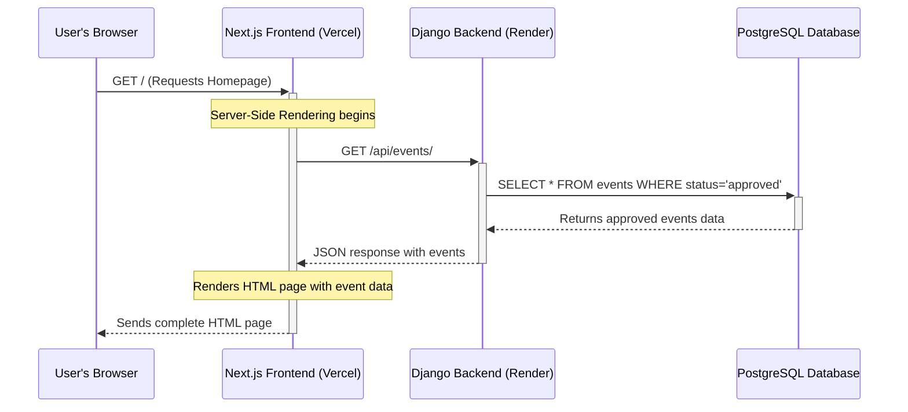
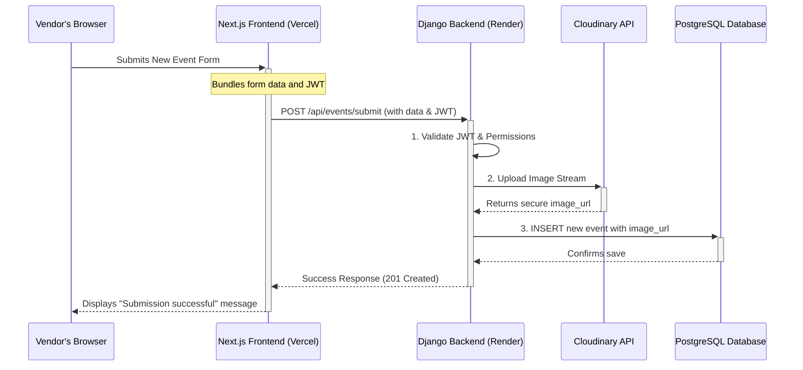

# Core Workflows

### Workflow 1: Public User Fetches Events

This diagram shows how a public user visiting the homepage receives the list of approved events, leveraging Next.js's Server-Side Rendering (SSR) for performance and SEO.

### Workflow 2: Vendor Submits a New Event

This diagram details the authenticated process for a vendor submitting a new event, including the secure interaction with the Cloudinary image service.


