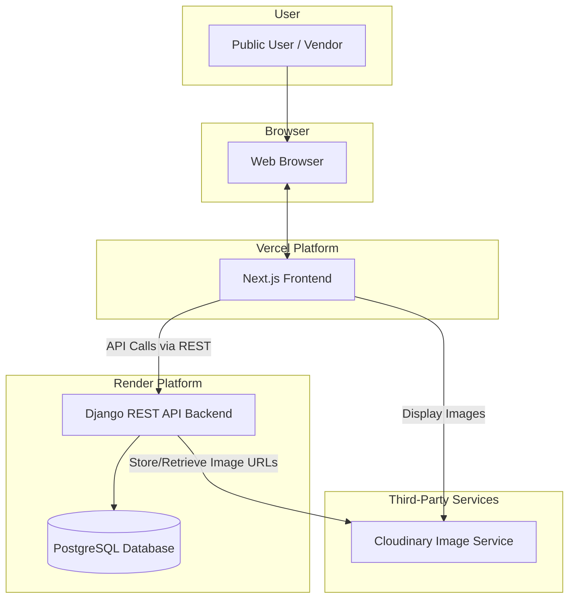

# High Level Architecture

### Technical Summary

The architecture for CulturaLite is a modern, decoupled full-stack application. It features a Next.js frontend responsible for rendering the user interface and handling user interactions, which communicates via a REST API with a Django backend. The backend manages all business logic, data persistence in a PostgreSQL database, and vendor authentication using JWT. This design directly supports the project's goals by leveraging Next.js for strong SEO and performance, while using Django for rapid and secure backend development.

### Platform and Infrastructure Choice

The application will be deployed across specialized, best-in-class platforms to optimize for performance, developer experience, and cost-effectiveness.

  * **Platform:**
      * **Frontend:** Vercel
      * **Backend:** Render
  * **Key Services:** Vercel (Hosting, CI/CD, Global CDN), Render (Backend Hosting, Managed PostgreSQL, CI/CD), Cloudinary (Image Management API).
  * **Deployment Regions:** To ensure the best performance for the target audience, I recommend deploying to regions in or near India.
      * **Vercel:** `bom1` (Mumbai, India)
      * **Render:** `Singapore`

### Repository Structure

  * **Structure:** **Polyrepo**. We will use two separate repositories to maintain a clean separation of concerns between the frontend and backend codebases.
      * `culturalite-frontend`: The Next.js application.
      * `culturalite-backend`: The Django application.
  * **Monorepo Tool:** Not applicable.

### High Level Architecture Diagram

This diagram illustrates the primary components of the system and the flow of information between them.

### Architectural and Design Patterns

  * **Decoupled Frontend/Backend:** The frontend (Next.js) is a separate application from the backend (Django). This allows for independent development, deployment, and scaling of each component.
  * **REST API:** The standard for all communication between the frontend and backend. The Django backend will expose a well-defined RESTful API for the frontend to consume.
  * **Server-Side Rendering (SSR) & Static Site Generation (SSG):** We will leverage Next.js's rendering capabilities for the public-facing pages (Homepage, City Listings) to achieve excellent SEO and fast initial page loads.
  * **Token-Based Authentication (JWT):** The backend will issue JSON Web Tokens to authenticated vendors. The frontend will include these tokens in requests to secure access to protected resources, such as the vendor dashboard.


